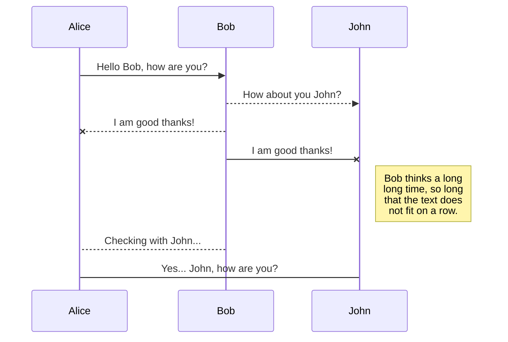
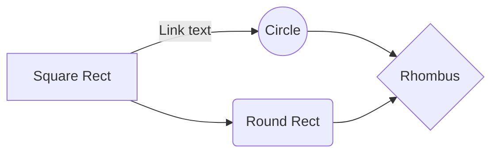

# Documentacion-y-validacion

# Encabezado h1
## Encabezado h2
### Encabezado h3
#### Encabezado h4
##### Encabezado h5
###### Encabezado h6
- Elemento 1
- Elemento 2
- Elemento 3
1. E1
2. E2
3. E3
**Letra negrita** Este es un comentario
*letra cursiva*
[Link Homero](https://www.youtube.com/watch?v=eCQpG46f3p8)

|column1|column2|column3|column4|column5|
|-------|-------|-------|-------|-------|
|  12   |   31  |   64  |  78   |  53   |
|   8   |   5   |   4   |   3   |  2    |
|       |       |       |       |       |

|Quotes          |`"Isn't this fun?"`            |"Isn't this fun?"            |
|Dashes          |`-- is en-dash, --- is em-dash`|-- is en-dash, --- is em-dash|

## KaTeX

You can render LaTeX mathematical expressions using [KaTeX](https://khan.github.io/KaTeX/):

The *Gamma function* satisfying $\Gamma(n) = (n-1)!\quad\forall n\in\mathbb N$ is via the Euler integral

$$
\Gamma(z) = \int_0^\infty t^{z-1}e^{-t}dt\,.
$$

> You can find more information about **LaTeX** mathematical expressions [here](http://meta.math.stackexchange.com/questions/5020/mathjax-basic-tutorial-and-quick-reference).

## UML diagrams

You can render UML diagrams using [Mermaid](https://mermaidjs.github.io/). For example, this will produce a sequence diagram:

And this will produce a flow chart:

